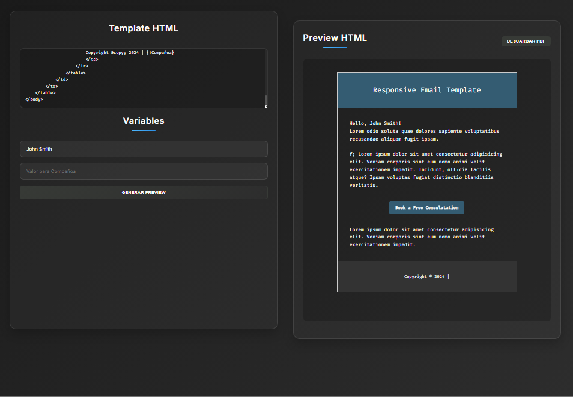
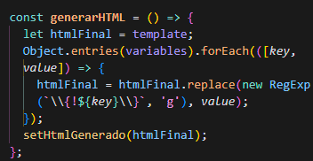

# Inyector HTML para ReactJS


[](https://opensource.org/licenses/MIT)

## Acerca del proyecto
Herramienta para generar contenido HTML dinámico mediante la inserción de variables en plantillas predefinidas. Permite la generación de PDFs a partir de templates HTML con variables dinámicas.

## Tecnologías
- React 18+
- JavaScript ES6+
- HTML5 y CSS3
- html2pdf.js
- Node.js y NPM

## Características
- Inyección dinámica de variables en HTML
- Vista previa en tiempo real del resultado
- Interfaz intuitiva con 3 campos básicos
- Diseño responsive incorporado
- Generación de código HTML listo para usar
- Exportación a PDF

## Uso
- Completa los campos del formulario
- Haz clic en "Generar vista previa"
- Visualiza el resultado en el panel de preview
- Descarga el PDF generado

## Estructura del proyecto
```bash
src/
├── components/      # Componentes reutilizables
├── context/        # Gestión de temas
├── styles/         # Estilos globales
└── App.jsx         # Núcleo de la aplicación
```

## Capturas de pantalla
| Menú Principal | Formulario de Contacto |
|----------------|------------------------|
|  |  |

## Contribuciones
Las contribuciones son bienvenidas. Por favor:
1. Haz un fork del proyecto
2. Crea tu rama (`git checkout -b feature/nueva-funcionalidad`)
3. Commitea tus cambios (`git commit -m 'Agrega una funcionalidad'`)
4. Haz push a la rama (`git push origin feature/nueva-funcionalidad`)
5. Abre un Pull Request

## Lenguajes
- JavaScript: 65%
- HTML: 20%
- CSS: 15%

## Licencia
Este proyecto está bajo la Licencia MIT. Consulta el archivo [LICENSE](./LICENSE) para más detalles.
